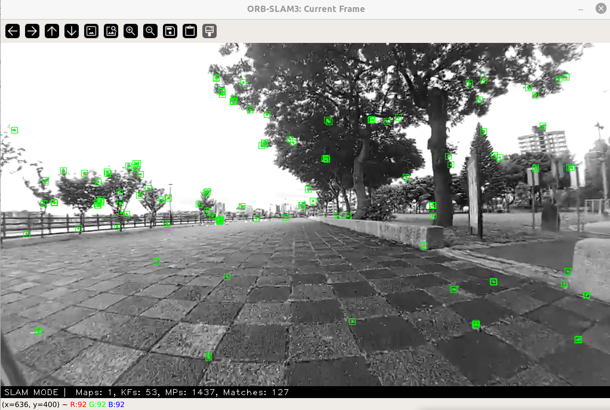
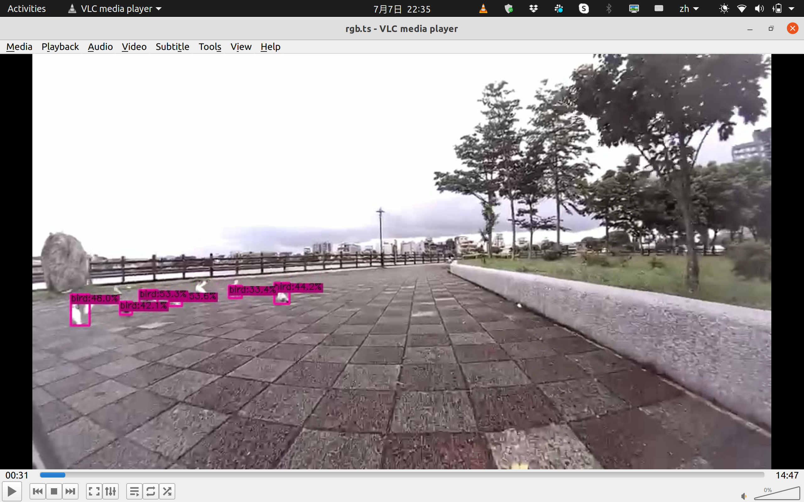
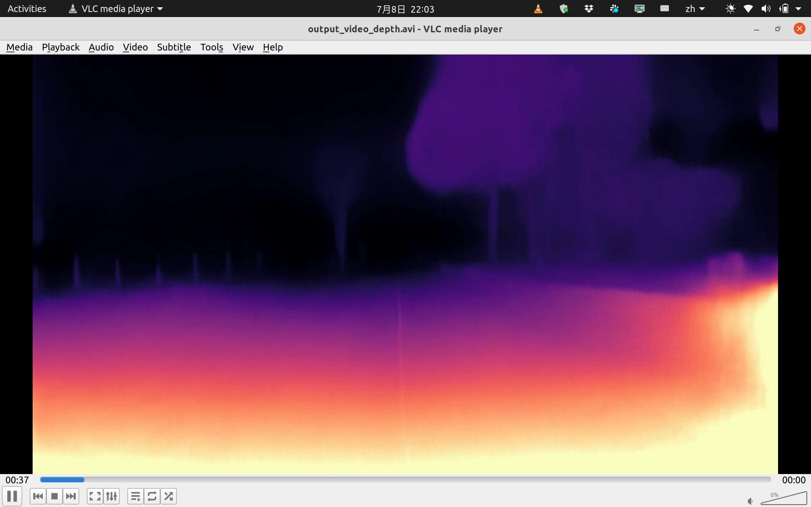

# vSLAM on FrodoBots-2K
FrodoBots-2K is an exciting dataset. We'll provide details on how to use it for visual SLAM. This toolkit accompanies our dataset paper https://arxiv.org/abs/2407.05735v1, and we will keep updating it to make the process easier.

## Table of Contents
- [vSLAM on FrodoBots-2K](#vslam-on-frodobots-2k)
  - [1. SLAM Setup (Using ORBSLAM3 as an Example)](#1-slam-setup-using-orbslam3-as-an-example)
    - [1.1 Download the Dataset](#11-download-the-dataset)
    - [1.2 Calibration](#12-calibration)
    - [1.3 Merge Video Frames](#13-merge-video-frames)
    - [1.4 Modify CMakeLists.txt to Compile the New Calibration Model](#14-modify-cmakeliststxt-to-compile-the-new-calibration-model)
    - [1.5 Run ORBSLAM3](#15-run-orbslam3)
  - [2. Object Detection (Using YOLOX as an Example)](#2-object-detection-using-yolox-as-an-example)
    - [2.1 Merge Video Frames](#21-merge-video-frames)
    - [2.2 Produce Object Detection Results](#22-produce-object-detection-results)
    - [2.3 Get the Resulting Video](#23-get-the-resulting-video)
  - [3. Depth Estimation (Using Lite-Mono as an Example)](#3-depth-estimation-using-lite-mono-as-an-example)
    - [3.1 Merge Video Frames](#31-merge-video-frames)
    - [3.2 Estimate Depth](#32-estimate-depth)
    - [3.3 Get the Resulting Video](#33-get-the-resulting-video)
- [Real FrodoBots Deployments](#real-frodobots-deployments)
  - [0. Want to Calibration？](#0-want-to-calibration)
  - [1. Want to apply the vSLAM algorithm to it?(take ORBSLAM3 as an example)](#1-want-to-apply-the-vslam-algorithm-to-ittake-orbslam3-as-an-example)
- [Citation](#citation)
## 1. SLAM Setup (Using ORBSLAM3 as an Example)

### 1.1 Download the Dataset
Download the dataset from the following link: [FrodoBots-2K Dataset](https://huggingface.co/datasets/frodobots/FrodoBots-2K)

### 1.2 Calibration
According to our experiments, the approximate calibration parameters are as specified in the file `Robot_Zero.yaml`. We have ordered the robot, but it will take some time for delivery.

### 1.3 Merge Video Frames
The video frames in FrodoBots-2K are discrete, so you need to merge them into a longer video. The script `merge_ts_files.sh` will help you:

```bash
mv merge_ts_files.sh /home/zhangqi/Downloads/output_rides_21/ride_38222_20240501013650
chmod +x merge_ts_files.sh
./merge_ts_files.sh
```
The sequence is ready to use!

### 1.4 Modify CMakeLists.txt to Compile the New Calibration Model
Add the following lines to your `CMakeLists.txt`:

```cmake
add_executable(Robot_zero
        Examples/Monocular/Robot_zero.cc)
target_link_libraries(Robot_zero ${PROJECT_NAME})
```

### 1.5 Run ORBSLAM3
Run ORBSLAM3 with the following command:

```bash
./Examples/Monocular/Robot_Zero Vocabulary/ORBvoc.txt Examples/Monocular/Robot_zero.yaml /home/zhangqi/Downloads/output_rides_21/ride_38222_20240501013650
```



## 2. Object Detection (Using YOLOX as an Example)

### 2.1 Merge Video Frames
Again, merge the video frames into a longer video using `merge_ts_files.sh`:

```bash
mv merge_ts_files.sh /home/zhangqi/Downloads/output_rides_21/ride_38222_20240501013650
chmod +x merge_ts_files.sh
./merge_ts_files.sh
```

### 2.2 Produce Object Detection Results
Download the script `run_video.py` and run the object detection:

```bash
python run_video.py video -f /home/zhangqi/Documents/Library/YOLOX/exps/default/yolox_s.py -c /home/zhangqi/Documents/Library/YOLOX/yolox_s.pth --path /home/zhangqi/Downloads/output_rides_21/ride_38222_20240501013650/recordings/rgb.ts --save_result
```

### 2.3 Get the Resulting Video
Find the resulting video in `./YOLOX_outputs/yolox_s/vis_res/2024_07_07_21_30_59`.



## 3. Depth Estimation (Using Lite-Mono as an Example)

### 3.1 Merge Video Frames
Merge the video frames using `merge_ts_files.sh`:

```bash
mv merge_ts_files.sh /home/zhangqi/Downloads/output_rides_21/ride_38222_20240501013650
chmod +x merge_ts_files.sh
./merge_ts_files.sh
```

### 3.2 Estimate Depth
Download the script `video_depth_prediction.py` and move it to the LiteMono directory. Run the depth estimation:

```bash
python video_depth_prediction.py --video_path /home/zhangqi/Downloads/output_rides_21/ride_38222_20240501013650/recordings/rgb.ts --output_path output_video_depth.avi --load_weights_folder /home/zhangqi/Documents/Library/Lite-Mono/pretrained_model --model lite-mono8m
```

### 3.3 Get the Resulting Video
Find the resulting video in `LiteMono/`.


# Real FrodoBots Deployments
## 0. Want to Calibration？
You are soooooo cool! Pls refer to the Calibration file fold to do that!

You also need to refer to this URL to get THE TOKEN. You should buy the FrodoBots and ask their team about the TOKEN
> https://github.com/frodobots-org/earth-rovers-sdk/tree/main

Then you need to run your code! We need to prepare a checkerboard grid to be fixed in front of the robot, and the robot will automatically perform the calibration and corresponding movements.
```bash
pip install requirements.txt
python auto_calibration.py
```
## 1. Want to apply the vSLAM algorithm to it?(take ORBSLAM3 as an example)
```bash
python Orbslam3_deployments.py
```

### Citation
To cite this work, please use the following reference in English:

```plaintext
@misc{zhang2024earthroverdatasetrecorded,  
      title={An Earth Rover dataset recorded at the ICRA@40 party},  
      author={Qi Zhang and Zhihao Lin and Arnoud Visser},  
      year={2024},  
      eprint={2407.05735},  
      archivePrefix={arXiv},  
      primaryClass={cs.RO},  
      url={https://arxiv.org/abs/2407.05735}  
}
```
